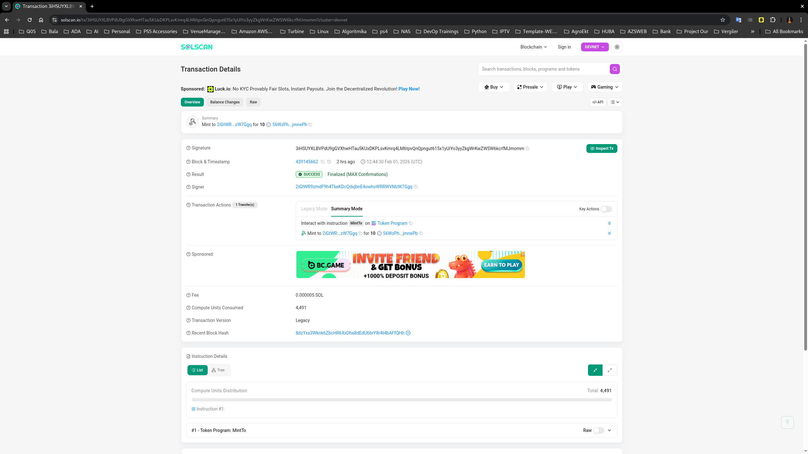
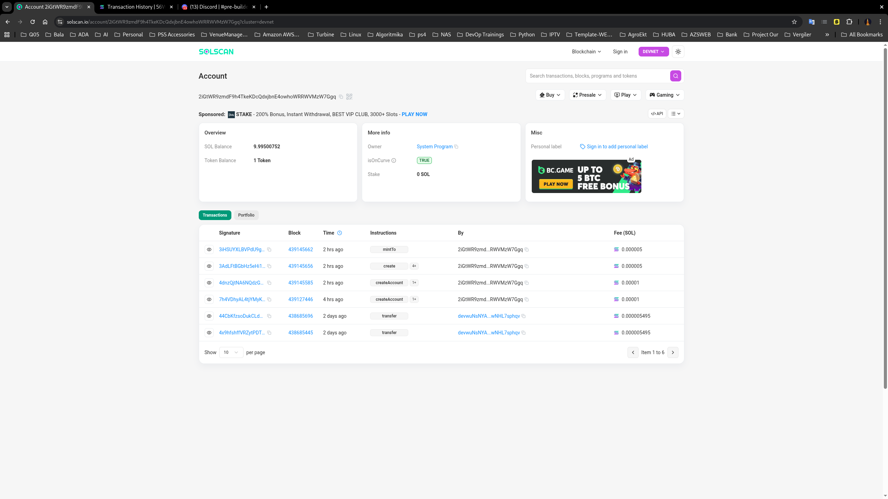
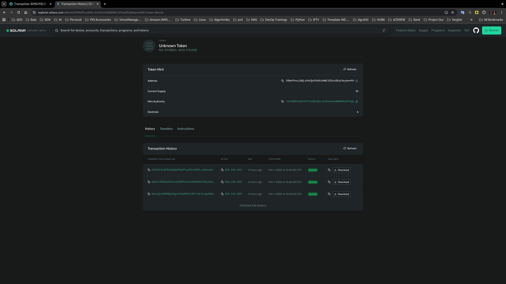

## ✅ README.md

````markdown
# Token Minting Proof (Solana / Anchor)

This repository contains proof of successful token minting performed in Devnet.

The purpose of this README is to provide verifiable evidence (screenshots + transaction data) for Pull Request review and approval.

---

## 📌 Environment

- Anchor Framework
- Rust
- Solana CLI
- Solscan verification

---

## 🪙 Minted Token Information

| Parameter            | Value                                  |
|----------------------|----------------------------------------|
| Token Mint Address   | `56WzPhuoj9QLv5nEQoSSb8ibNAC3ZGssDEqt9wjmnePb`             |
| Decimals             | `10n`                                                      |
| Authority            | `GrBSfbex6uxKjMEzaLD7VidGdtAeo17LzwNchyWQPqDx`             |

---

## 🔗 Minting Transaction

| Parameter              | Value                                  |
|------------------------|----------------------------------------|
| Transaction Signature  | `3iHSUYXLBVPdU9gGVXhwHTau5KUxDKPLsvKmrq4LM6tpvQnQpngut615x1yUiYo3yyZkgWrKwZWSW6kcrfMJmomm`                  |

You can verify the transaction using Solscan (custom RPC for localhost or replay on devnet if applicable).

---

## 📷 Screenshots

### 4️⃣ SolScan Verification,Transactions & History





### 5 SolExplorer Verification,Transactions & History




---

## ▶️ Steps Performed

1. Created token mint and minted tokens via spl_init.ts and spl_mint.ts.

2. Verified transaction by signature by solscan and solana-explorer

---

## 🧾 Proof Summary

This PR includes:

* Screenshots of the minting process
* Token mint address
* Transaction signature hash
* Evidence of successful deployment and execution

---

## 👤 Author

**Orkhan Iskandarov**

```

---

### 📁 Repo structure

```

repo/
├─ README.md
└─ screenshots/
├─ mint-tx.png
└─ solscan-verification.png

```